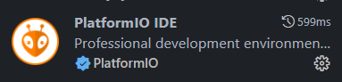
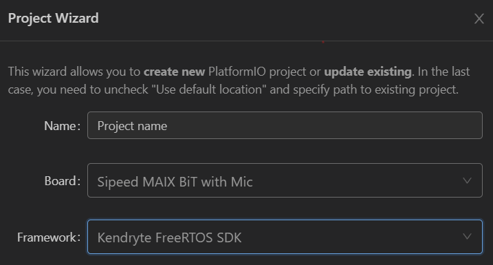
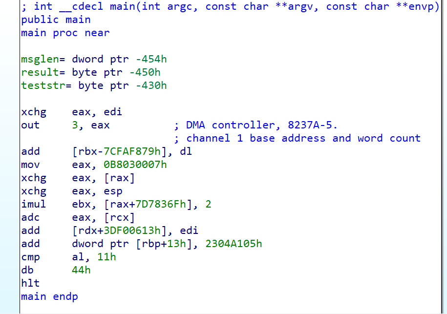

# Platform IO x FreeRTOS 环境搭建

> &emsp;&emsp;本文档是对Platform IO上配置 Maix Bit开发板FreeRTOS框架的流程说明，以及当时使用过程中遇到的问题。还有对Platform IO 工作原理的大致研究。

## 安装Platform IO插件

VSCode安装 Platform IO 拓展，需要安装一个内置的Python环境；

## 新建工程

在Platform IO中新建工程，Project Wizard 会帮助进行初步环境配置和包依赖管理。

指定项目名称，填写对应开发板信息和使用的框架，就可以完成一个新工程的初始化。

**如果工程的依赖库是第一次被使用，那么Platform IO将会自动下载依赖包**。依赖包位置在`~/.platformio/packages`下。等待依赖包安装完成，就可以启动工程。

## 工程操作

一般常用的工程操作命令如下：

### Build

&emsp;&emsp;编译工程，将工程文件编译为目标机器的可执行文件。**如果目标机器的架构与当前架构不同，会使用交叉编译工具链。**指定开发板型号后，交叉编译工具链作为依赖包被下载。
&emsp;&emsp;编译采用最小重新生成，一般仅对存在修改的文件进行重编译。如果需要全部重编译，可以使用`Clear`操作，清除所有已生成内容。

### Upload

&emsp;&emsp;将生成的固件上传到目标机器上，一般通过ISP模式进行烧写。进入ISP模式后，允许主机通过软件的形式对目标机器的Flash进行读写操作。本工程使用的烧写工具为`kflash`

### Serial Monitor

&emsp;&emsp;完成固件烧写后，目标机器开始运行FreeRTOS系统和我们的程序。我们可以通过串口和其进行通信。使用Serial Monitor可以监视输出并进行输入。在FreeRTOS上，串口的输入输出是默认的`stdin`/`stdout`

## 原理浅析

### 编译过程

&emsp;&emsp;`packages`主要分为两种，`platform`类型和`tools`类型。我们使用的`FreeRTOS SDK`输入platform，而对RISC-V架构的交叉编译工具链属于Tools。在编译的过程中，会将Platform和用户代码结合，统一进行编译。SDK中还存有编译相关的Travis配置，修改部分配置可以实现对平台的自定义使用。编译生成二进制代码固件和对应ELF文件（用于调试）。反汇编结果如下：

## 遇到的困难

&emsp;&emsp;一开始上传固件的时候，通信一直显示握手失败，无法进入ISP模式。但是通信波特率和串口号经过反复检查没有问题。

&emsp;&emsp;最后发现是开发板细分版本选择错误，导致握手方式错误，握手失败。后改为正确的开发板，成功进入ISP烧录模式。