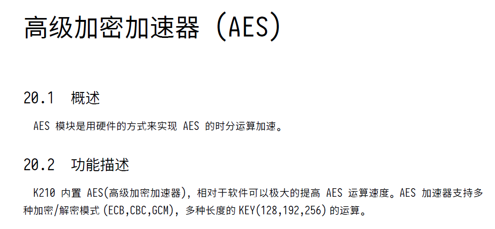

# 实现思路

## 初期资料查找

刚接触选题时，进行了一些初步信息搜集工作，查找信息包括：

* `GmSSL` 项目，包括其文件结构和模块的接口规范
* RISC-V 架构基本介绍
  * RISC-V 硬件
  * RISC-V 指令集架构
* FreeRTOS 基本介绍
  * FreeRTOS 应用场景
  * FreeRTOS 基本结构与使用
* X86 - RISC-V 交叉编译工具链
  * gcc工具链

## 确定早期方向

&emsp;&emsp;资料查找过程中，我们调查了市场上主流的RISC-V小型/嵌入式处理器开发板的相关信息，发现SIPEED 基于 Kendryte K210 RISC-V 芯片开发的 Maix Bit 开发板在在成本和架构方面都具有优势。RISC-V 64bit 正是当前RISC-V架构的学习研究主流方向，并且这个系列的开发板价格比国外大多数RISC-V架构开发板低。另外，Kendryte K210 和 Maix Bit 提供了较为完整的开发文档和SDK作为参考，方便我们的进一步开发。

&emsp;&emsp;考虑我们项目的适用场景、成本，以及上面诸多因素，**我们决定使用Maix Bit作为我们项目的物理开发载体，进行实机开发。**

&emsp;&emsp;实机开发可以最大限度地**还原物联网/边缘计算设备的工作环境及特性，如工作频率不高、内存较小等**，这为我们的开发加上了一些限制，但同时也为我们的生产环境适配提供了方便。在开发之初就考虑到这些限制，可以避免应用过程中的许多重复劳动。

## 二次信息搜集

&emsp;&emsp;初步确定研究方向后，我们进行了第二次信息搜集。这次搜集主要是针对Maix Bit 开发板的开发环境配置和我们项目成果的形式，搜集信息如下：

* Maix Bit 开发环境配置
  * Maix Bit environment
  * Kendryte-FreeRTOS-SDK
* Platform IO
  * Serial Monitor
  * `kflash` ISP upload

## 确定成果形式

&emsp;&emsp;根据上面的信息搜集，我们研究发现，**FreeRTOS SDK for K210**能够完整适配Maix Bit开发版。并且提供了很方便的接口和丰富的驱动程序。

&emsp;&emsp;所以，我们选择在这个SDK的基础上进行开发，

* 首先，完成一个用户程序，实现SM3和SM4算法在开发板上的正确运行
* 其次，将用户程序封装，构建一个第三方库，提供更加标准化的功能
* 然后，逐步优化算法实现，加快效率；丰富接口，以适应更多使用场景

**成果形式为：一个支持SM3和SM4的第三方库，附带完整文档。**用户程序引用对应头文件，就可以调用SM3、SM4算法提供的功能。

## 成果补充

> 这里写一些补充的预期成果，比如实验等衍生品

## 对硬件加速的尝试

&emsp;&emsp;查找资料发现，K210内含一个硬件层面计算SHA-256 和 AES 的接口，我们试图通过这个接口移植SM3、SM4，即通过修改参数和部分过程等方法，让硬件接口完成部分我们需要的计算过程，以加快运算效率。



但经过进一步研究发现，**K210的硬件加速实现完全封装在硬件中，甚至不能修改算法的初始向量（IV）**。

```c++
virtual void sha256_hard_calculate(gsl::span<const uint8_t> input_data, gsl::span<uint8_t> output_data) override
    {
        COMMON_ENTRY;

        uint32_t i = 0;
        sha256_context_t context;
        sha256_.sha_function_reg_0.sha_endian = SHA256_BIG_ENDIAN;
        sha256_.sha_function_reg_0.sha_en = ENABLE_SHA;
        sha256_.sha_num_reg.sha_data_cnt = (input_data.size() + SHA256_BLOCK_LEN + 8) / SHA256_BLOCK_LEN;
        context.dma_buf = (uint32_t *)malloc((input_data.size() + SHA256_BLOCK_LEN + 8) / SHA256_BLOCK_LEN * 16 * sizeof(uint32_t));
        context.buffer_len = 0L;
        context.dma_buf_len = 0L;
        context.total_len = 0L;
        for (i = 0; i < (sizeof(context.dma_buf) / 4); i++)
            context.dma_buf[i] = 0;
        sha256_update_buf(&context, input_data.data(), input_data.size());
        sha256_final_buf(&context);

        uintptr_t dma_write = dma_open_free();

        dma_set_request_source(dma_write, SYSCTL_DMA_SELECT_SHA_RX_REQ);

        SemaphoreHandle_t event_write = xSemaphoreCreateBinary();

        dma_transmit_async(dma_write, context.dma_buf, &sha256_.sha_data_in1, 1, 0, sizeof(uint32_t), context.dma_buf_len, 16, event_write);	// push to AES hardware device via DMA
        sha256_.sha_function_reg_1.dma_en = 0x1;
        configASSERT(xSemaphoreTake(event_write, portMAX_DELAY) == pdTRUE);

        while (!(sha256_.sha_function_reg_0.sha_en))
            ;
        for (i = 0; i < SHA256_HASH_WORDS; i++)
            *((uint32_t *)&output_data[i * 4]) = sha256_.sha_result[SHA256_HASH_WORDS - i - 1];
        free(context.dma_buf);
        dma_close(dma_write);
        vSemaphoreDelete(event_write);
    }
```

函数的注释行将需要运算的数据流推送到对应的硬件加速模块中，完成计算后取出，没有任何提供修改的接口。*最后我们放弃了利用原有硬件加速结构完成国密算法加速的尝试。*