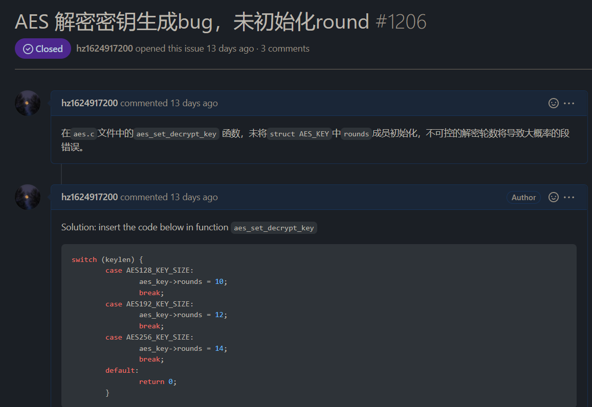

# 成果

## 改进GmSSL

### 引入

&emsp;&emsp;在对GmSSL项目进行研究学习的时候，我们发现其AES算法功能模块输出错误，且有很大概率产生段错误`segmentation fault`进而崩溃。产生兴趣对其进行gdb代码级调试，发现问题。

### 问题描述

在`aes.c`文件中的`aes_set_decrypt_key` 函数，未将`struct AES_KEY`中`rounds`成员初始化，不可控的解密轮数将导致大概率的段错误。

### 解决方法

```c
for (i = 0; i <= enc_key.rounds; i++) {
		aes_key->rk[4*i    ] = enc_key.rk[4*(enc_key.rounds - i)];
		aes_key->rk[4*i + 1] = enc_key.rk[4*(enc_key.rounds - i) + 1];
		aes_key->rk[4*i + 2] = enc_key.rk[4*(enc_key.rounds - i) + 2];
		aes_key->rk[4*i + 3] = enc_key.rk[4*(enc_key.rounds - i) + 3];
	}
	aes_key->rounds = enc_key.rounds;	// added
	ret = 1;
```

* 在解密密钥初始化处对成员`rounds`进行初始化

### 处理结果

向项目提交Issue，目前已经被接受并完成修改。`Issue #1206`



