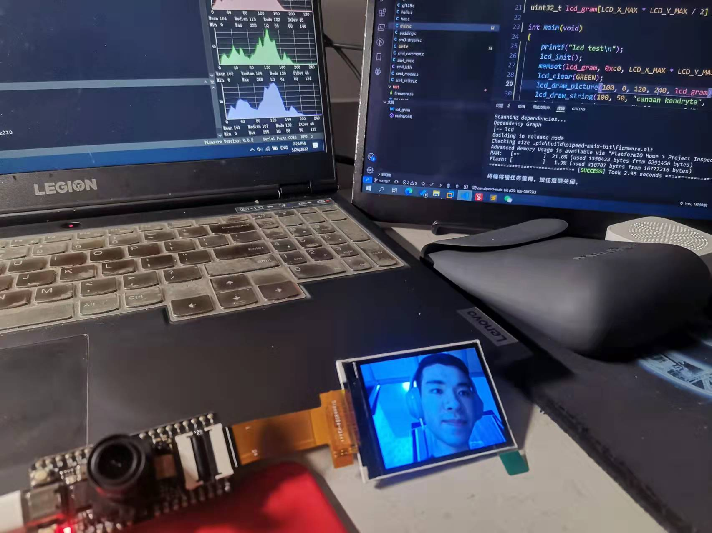

# Demo Source Code

> &emsp;&emsp;此为使用国密算法库进行视频流加密以及校验传输的代码样例。

## 文件结构/说明

```
src
├── hello.c # 用于测试硬件平台的初始样例，可由../include/features.h进行切换
├── main.c	# 视频流采集、加密、校验、传输的demo源文件
└── README.md	# 本说明文档
```


## 样例说明

&emsp;&emsp;样例通过 K210 FreeRTOS SDK 的任务调度接口拓展，**在两个核心上分别建立两个任务**，以使用多核多任务的FreeRTOS调度。

### TaskDataEncrypt

&emsp;&emsp;数据加密与校验码生成任务。当来自外部的缓冲区被填充，任务通过信号量被唤醒。将缓冲区中的数据**通过SM4进行加密，并通过SM3计算哈希值，作为加密数据的完整性校验码。**产生的数据被输出到标准输出流。

### DataGenerate

&emsp;&emsp;主程序初始化摄像头模块，通过摄像头模块采集图像数据，并输出到缓冲区。当数据采集完成，通过信号量唤醒数据加密任务。


## 样例展示

样例成果展示如图：



**另有样例演示视频：**

* [Demo1](../Demo1.mp4)
* [Demo2](../Demo2.mp4)

